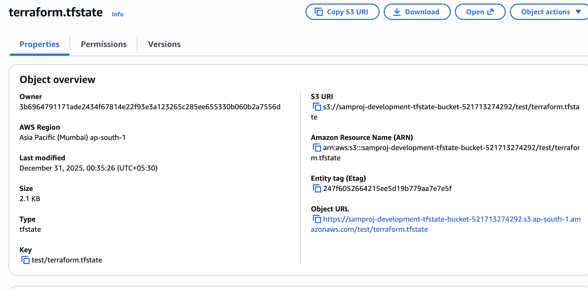
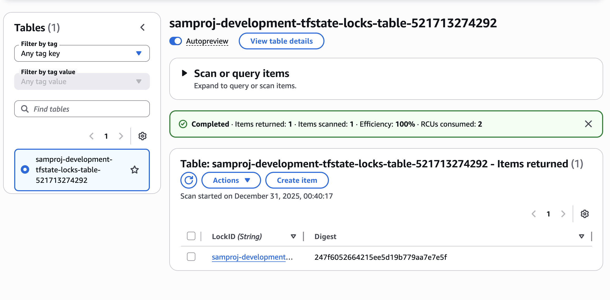

# Terraform Backend: S3 with DynamoDB Locking

This Terraform module creates a remote backend infrastructure for storing Terraform state files in AWS S3 with optional DynamoDB state locking.

## Overview

This configuration provisions:
- An S3 bucket for storing Terraform state files
- S3 bucket versioning for state file history
- S3 bucket encryption for security
- Public access blocking on the S3 bucket
- Lifecycle rules for object expiration
- Lifecycle prevent_destroy protection (optional)
- A DynamoDB table for state locking (optional)
- Point-in-time recovery for DynamoDB (optional)

### S3 State Bucket



### DynamoDB Lock Table



## Prerequisites

- AWS CLI configured with appropriate credentials
- Terraform >= 1.0
- AWS account with permissions to create S3 buckets and DynamoDB tables

## Usage

### Basic Usage

```hcl
terraform init
terraform plan
terraform apply
```

### Custom Configuration

Create a `terraform.tfvars` file to customize the deployment:

```hcl
project_name                = "my-project"
environment                 = "production"
short_name                  = "myproj"
s3_bucket_name              = "custom-bucket-name"
dynamodb_table_name         = "custom-table-name"
enable_dynamodb_locking     = true
versioning_enabled          = true
server_side_encryption      = true
prevent_s3_bucket_destroy   = true
```

## Variables

| Variable | Description | Default | Required |
|----------|-------------|---------|----------|
| `project_name` | Name of the project | "Samarths-Project" | No |
| `environment` | Environment name | "development" | No |
| `short_name` | Short name for resource naming | "samproj" | No |
| `s3_bucket_name` | Custom S3 bucket name | Auto-generated | No |
| `s3_expiration_days` | Days until objects expire | 90 | No |
| `block_public_access` | Block public access to S3 bucket | true | No |
| `versioning_enabled` | Enable S3 bucket versioning | true | No |
| `server_side_encryption` | Enable S3 encryption | true | No |
| `prevent_s3_bucket_destroy` | Prevent accidental bucket deletion | false | No |
| `s3_force_destroy` | Allow bucket deletion with objects | false | No |
| `enable_dynamodb_locking` | Enable DynamoDB state locking | true | No |
| `dynamodb_table_name` | Custom DynamoDB table name | Auto-generated | No |
| `enable_dynamodb_pitr` | Enable point-in-time recovery | true | No |
| `dynamodb_billing_mode` | DynamoDB billing mode | "PAY_PER_REQUEST" | No |

## Outputs

After applying, the following outputs are available:

- `s3_bucket_id` - The S3 bucket name
- `s3_bucket_arn` - The S3 bucket ARN
- `s3_bucket_region` - The S3 bucket region
- `dynamodb_table_name` - The DynamoDB table name (if enabled)
- `dynamodb_table_arn` - The DynamoDB table ARN (if enabled)
- `terraform_backend_config` - Complete backend configuration object
- `project_name` - Project name
- `environment` - Environment name
- `aws_account_id` - AWS account ID
- `aws_region` - AWS region

## Using the Backend

After creating the backend infrastructure, configure your Terraform projects to use it:

```hcl
terraform {
  backend "s3" {
    bucket         = "your-bucket-name"
    key            = "path/to/terraform.tfstate"
    region         = "us-east-1"
    dynamodb_table = "your-table-name"
    encrypt        = true
  }
}
```

You can retrieve these values from the outputs after applying this configuration.

## Security Features

- S3 bucket encryption enabled by default
- Public access blocked on S3 bucket
- Versioning enabled for state file recovery
- Lifecycle prevent_destroy protection available
- DynamoDB point-in-time recovery enabled
- All resources tagged with metadata

## Resource Naming Convention

Resources are named using the pattern:
```
{short_name}-{environment}-{resource-type}-{account-id}
```

Example: `samproj-development-tfstate-bucket-123456789012`

## Cleanup

To destroy all resources:

```bash
terraform destroy
```

**Important Notes:**
- If `s3_force_destroy` is set to `false` (default), you must manually empty the S3 bucket before destroying
- If `prevent_s3_bucket_destroy` is set to `true`, you must first set it to `false` and re-apply before you can destroy the bucket
- For buckets with versioning enabled, you need to delete all object versions and delete markers before destruction

## License

This configuration is provided as-is for infrastructure management purposes.